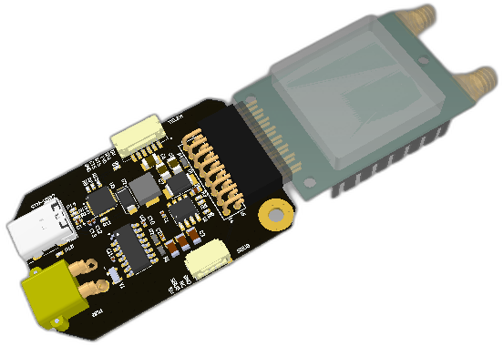
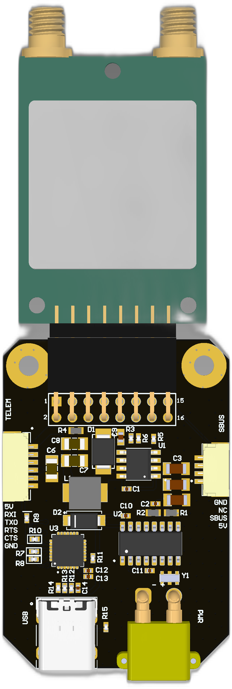
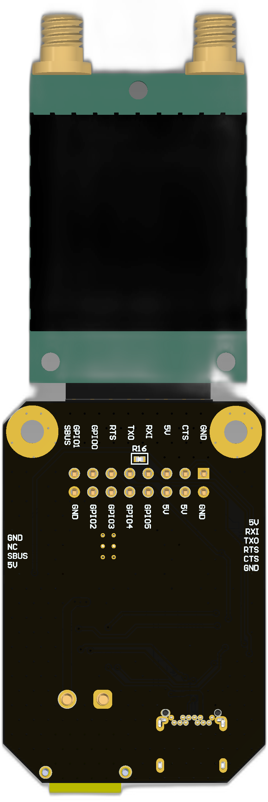
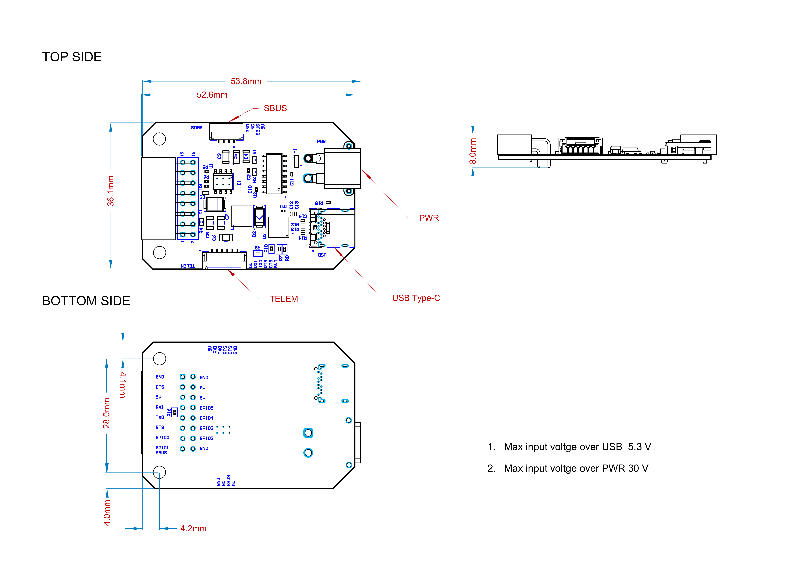

# RFD900X Holder v1.0.1 hardware 

| View | Top | Bottom |
| ---- | --- | ------ |
|  |  |  |
|  |  |  |

## Features

## Wiring

Schematic features. Schematic can be provided via issue.

**Connectors**

The node has connectors which are described in the table below.

| N | Connector | Description |
| - | - | - |
| 1 | SBUS |  |
| 2 | TELEM |  |

[Here](https://docs.raccoonlab.co/guide/wires/) you can find manufacturer part number of connectors it self and its mates.

## Pin configuration and functions

| Pin N | SBUS | Pin N | TELEM |
| ----- | ---------------- | ----- | ---------------- |
| 1 | 5V | 1 | 5V |
| 2 | GPIO1 | 2 | RXI_RFD |
| 4 | GND | 3 | TXO_RFD |
| SH1 | GND | 4 | RTS |
| SH2 | GND | 5 | CTS |
| 6 | GND |
| S1 | GND |
| S2 | GND |

Here you can see all connections of MCU.

| MCU PIN         | PIN Numer | NET Name | Description |
| ---------- |  -- | --------------  | - |

## Specifications

**Mechanical**

Scheme is shown on the picture below. CAN model can be provided via email request or issue on github or downloaded on GrabCAD (opens new window).

|       | Width, mm | Length, mm | Height, mm |
| ----- | --------- | ---------- | ---------- |
|Outline|      36.1 |      106.6 |       13.7 |
|PCB    |      36.1 |      52.35 |        1.2 |

Total weight of device less than 50 g.

### Housing

Information about case presented here.

### Absolute Maximum Ratings

### Recommended operating conditions

### ESD ratings

### MTFF

## Integration

**Recommended mechanical mounting**

**Connection example diagram**

### Power Supply Recommendations

Device is designed to operate from an input voltage supply range between 4.5 V and 5.5 V over CAN2 or CAN3 connector, or 5.5 - 30 V from CAN1. This input supply must be able to withstand the maximum input current and maintain a stable voltage. The resistance of the input supply rail should be low enough that an input current transient does not cause a high enough drop that can cause a false UVLO fault triggering and system reset. The amount of bulk capacitance is not critical, but a 47-uF or 100-uF electrolytic capacitor is a typical choice.

## Revision history

|View |Version| Date| Description|
|-    |-      |-    |-           |

## Order details

### PCB Specification Selection

- Board type : Panel by PCBWay
- Break-away rail: Yes
- Instructions:
~~~
Final size is larger ( 36.1 x 106.6 mm ) than board it self ( 36.1 x 52.35 mm), 
take a look at the picure in attachements. 
Panel should be designed to be able to install PWM1, PWM2 while assembly.
~~~
- Route Process: Panel as PCBWay prefer
- X-out Allowance in Panel:  Accept

- Size (single): 36.1 x 52.35 mm
- Quantity (single): 200
- Layers: 2 -   ['Top Layer', 'Bottom Layer'] check [PCBway layer stack](https://www.pcbway.com/multi-layer-laminated-structure.html)

- Material: FR-4
- FR4-TG: TG 150-160
- Thickness: 1.2
- Min Track/Spacing: 8/8mil (0.2 mm)
- Min Hole Size: 0.3 mm
- Solder Mask: Black
- Silkscreen: White
- Edge connector: No
- Surface Finish: HASL with lead
- Yes - Tick means you accept we might change "HASL" to "ENIG" at our discretion without extra charge.
- Via Process: Tenting vias
- Finished Copper: 1 oz Cu
- Other Special request:
~~~
Final size is larger ( 36.1 x 106.6 mm ) than board it self ( 36.1 x 52.35 mm )
~~~

### Assembly Service

- Turnkey
- Board type : Panelized PCBs
-  Assembly Side(s): Both sides
- Quantity: 200
- Contains Sensitive components/parts - No; 
- Do you accept alternatives/substitutes made in China? - Yes

- Number of Unique Parts: 0
- Number of SMD Parts: 0
- Number of BGA/QFP Parts: 0
- Number of Through-Hole Parts: 0

### Additional Options

- Firmware loading: Yes
- Detailed information of assembly:
~~~
Firmware is in attachements.
Take a look at the picure in attachements should be installed from the side.
~~~

## Device and Documentation Support

- [User manual]()
- [Hardware docs](doc/doc.pdf)

## Device Support

- [Firmware sources]()
- [Firmware binary]()

## TERMS OF USAGE / LICENCE

The material provided in this Github repository is subject to the following conditions. 

Firmware files: All firmwares are free (but not open source). Besides unlimited private use you are also granted the permission to use them for commercial purposes under the condition that (1) you dont modify the firmware, e.g. remove or change copyright statements, (2) provide it for free, i.e. dont charge any explicit or implicit fees to your customers, and (3) correctly and clearly cite the origin of the firmware and the project web page in any product documentation or web page. 

Hardware files: All hardware, for which material is provided, is open source hardware, under the terms of the TAPR Open Hardware License as published by the Free Hardware Foundation, see http://www.tapr.org/ohl.html. The TAPR license explicitly permits essentially unlimited commercial use, with only few conditions such as that copyright logos are not removed.

